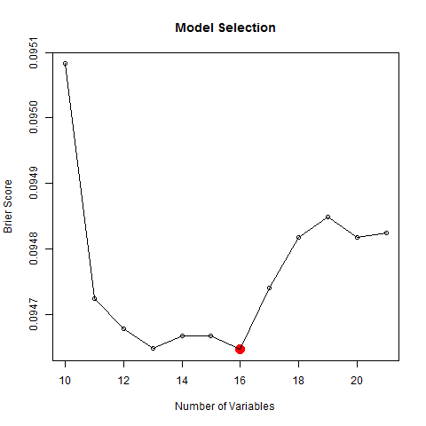
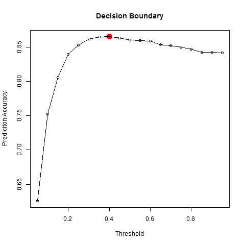

# About

## The Site

Upset Finder was launched in 2016 with the goal of providing fans a tool to find games of interest and help with March Madness.

Upset Finder provides insights on men's NCAA college basketball matchups.  Want to know which games most likely will result in an upset? Upset Finder can answer your question.

## Analysis

The proposed approach constructs a logistic regression model, built using 2015-2016 basketball season data. This process will provide the end user the ability to identify the potential upset matchups and its corresponding probability.

Manipulate and Format the data to reflect the below stats for each team: 3P, 3P%, 3PA, AST, BLK, Blocks, Date, DRB, DRtg, DRtg/A, ELO Rating, FG, FG%, FGA, FT, FT%, FTA, L, MP, ORB, ORtg, PF, PTS, Schl, SOS, STL, TOV, TOV%, TRB, Team, W, and W-L%. Descriptions and legend can be found below:

The statistics for each team and their opponent are matched and the relative difference is calculated. The resulting values are passed through a logistic regression model. Note, the team ELO rating is used to determine which team is favored (higher ELO rating) heading into the matchup.

Select variables in the context of generalized linear models using a stepwise procedure.

Figure 1 represents the comparison between models using the Brier score. Removal of variables was determined by selecting the least statistically significant variable.  The results show that the model with 16 variables performed the best.

Figure 2 represents the comparison of decision thresholds for the logistic model. Incrementing the decision threshold by 0.5 produced a curve to determine the optimal threshold. For the selected model, a threshold of 0.4 performs the best.

