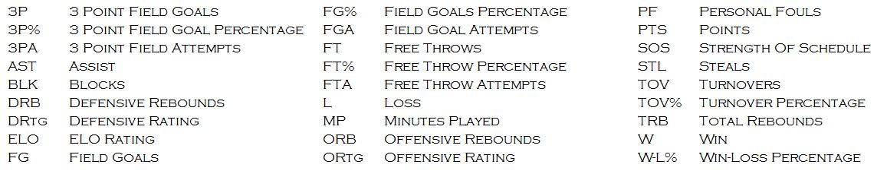

# About

## The Site

Upset Finder was launched in 2016 with the goal of providing fans a tool to find games of interest and help with March Madness.

Upset Finder provides insights on men's NCAA college basketball matchups.  Want to know which games most likely will result in an upset? Upset Finder can answer your question.

## Analysis

The proposed approach constructs a logistic regression model, built using 2015-2016 basketball season data. This process will provide the end user the ability to identify the potential upset matchups and its corresponding probability.

Manipulate and Format the data to reflect the below stats for each team: 3P, 3P%, 3PA, AST, BLK, Blocks, Date, DRB, DRtg, ELO Rating, FG, FG%, FGA, FT, FT%, FTA, L, MP, ORB, ORtg, PF, PTS, Schl, SOS, STL, TOV, TOV%, TRB, Team, W, and W-L%. Descriptions and legend can be found below:

The statistics for each team and their opponent are matched and the relative difference is calculated. The resulting values are passed through a logistic regression model. Note, the team ELO rating is used to determine which team is favored (higher ELO rating) heading into the matchup.

The data was through a Support Vector Machine, Logistic Regression, and Naive Bayes classification model. Each model was cross validated using 10 folds and tune for their specific parameter. The results show that the Support Vector Machine performed the best with an average ROC score of 0.85.

